# TOC

[TOC]

### busyindicator

### datepicker

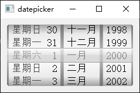

### datetimepicker

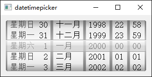

### imagelist

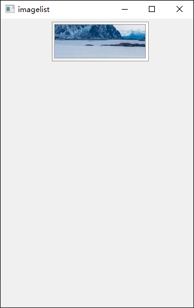

### listview

### messagebox

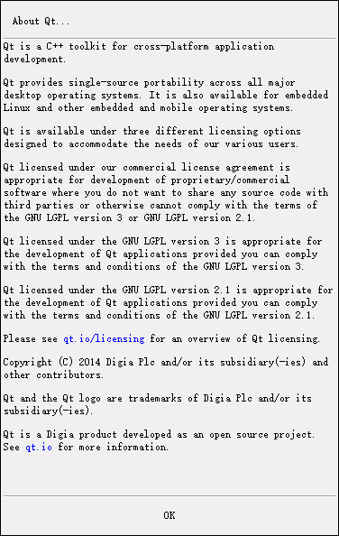

### navigationarrow

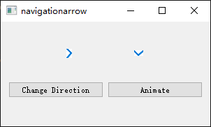

### navigationbar

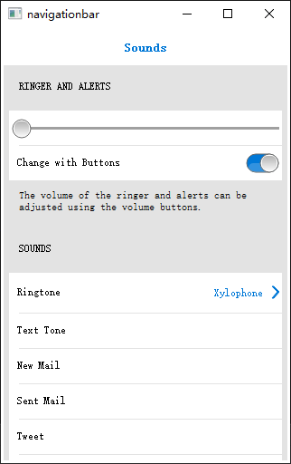

### navigationbutton

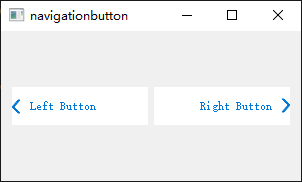

### pageview

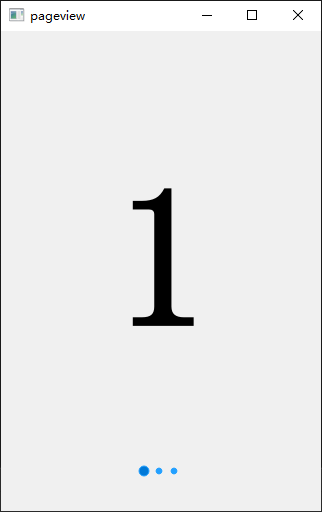

### picker

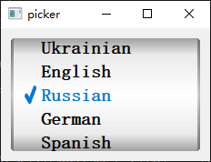

### progressbar

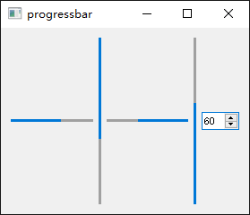

### scrollarea

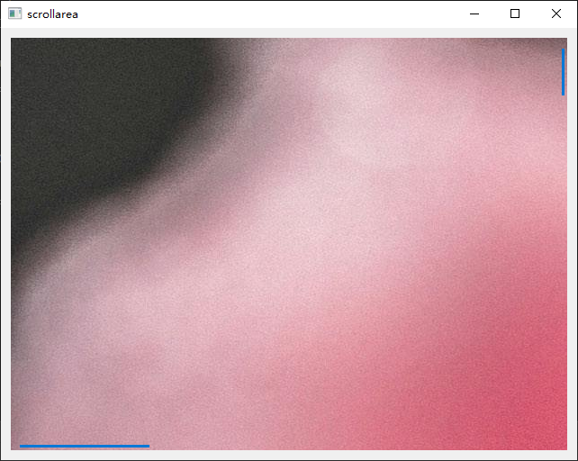

### slider

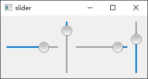

### stepper

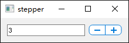

### switch

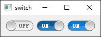

### tableview

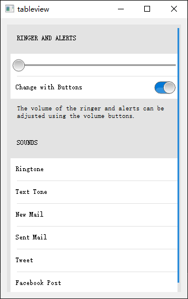

### timepicker

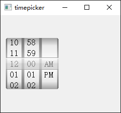

### toolbar

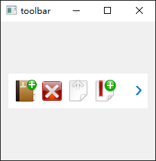

