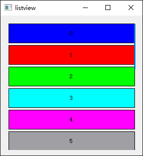

# TOC

[TOC]

### busyindicator

### datepicker

### datetimepicker

### imagelist

### listview

### messagebox

### navigationarrow

### navigationbar

### navigationbutton

### pageview

### picker

### progressbar

### scrollarea

### slider

### stepper

### switch

### tableview

### timepicker

### toolbar

